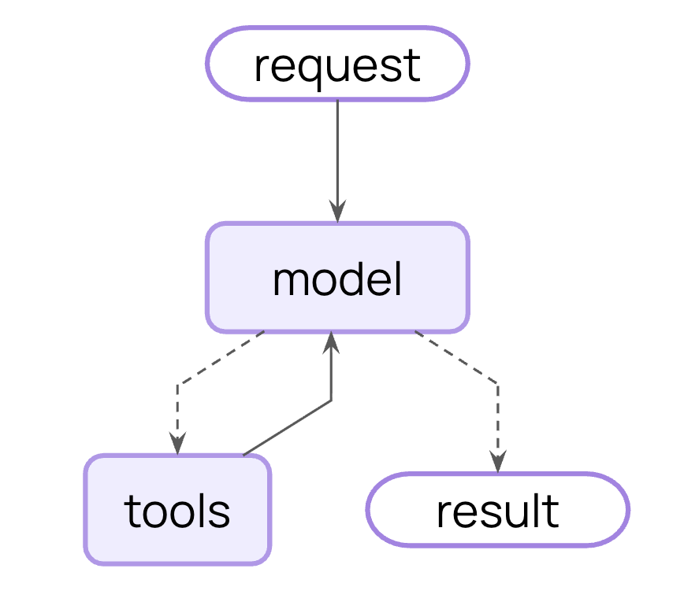

# 🚀 AutoPilot OS

## 📌 Overview

This project is an Autonomous AI Workflow Agent that automates everyday tasks such as drafting emails, scheduling events, sending reminders, and organizing context. It combines an LLM-powered reasoning engine with workflow logic to perform multi-step operations with minimal human input.

The system is built with FastAPI, LangChain, and external APIs like Gmail, Google Calendar, or Slack (depending on configuration).

This project serves as a lightweight foundation for experimenting with AI agents, task automation, and LLM-driven workflows.

## 🌊 User Flow

```
You: "Hey, send an email to John about tomorrow's meeting"
            ↓
Agent Planner: "I need to: 1) Draft email 2) Send via Gmail"
            ↓
Tool Router: "Route to Gmail tool"
            ↓
Executor: "Executing... email sent!"
            ↓
You: "Thanks! Can you also add it to my calendar?"
            ↓
Agent: "Done! Added to calendar for tomorrow at 2pm"
```

## 🤖 AI Agent Workflow

<p>Agentic Workflow for LangGraph (Tool Calling)</p>


## ✨ Features

- 🤖 Autonomous multi-step task execution
- 📧 Email generation + sending (Gmail API)
- 📅 Calendar event creation / scheduling
- 🔗 API-driven workflows (Slack, Notion, etc.)
- 🧠 LLM reasoning + tool use
- 🔌 Clean, modular architecture
- ⚡ FastAPI backend for triggering workflows

## 🎬 Project Demos

**Demo 1 (Dec. 4, 2025):** Terminal tool calling with email list and summaries.


## 🏗️ Tech Stack

- Python
- FastAPI
- LangChain / LangGraph (optional)
- OpenAI or Anthropic Models
- Google API (Gmail / Calendar)
- Slack SDK

## ⚙️ Setup

1. Clone the repo:

   ```bash
   git clone https://github.com/yourusername/autopilot-os.git
   cd autopilot-os
   ```

2. Install dependencies:

   ```bash
   pip install -r requirements.txt
   ```

3. Add your environment variables to `.env`:

   ```bash
   touch .env
   ```

   Add necessary API keys and configuration:

   ```
   DEBUG=True
   OPENAI_API_KEY=your_key_here
   # Add other required variables
   ```

4. Run the API:

   ```bash
   uvicorn backend.main:app --reload
   ```

### 🐳 Docker Setup (Alternative to Virtual Environment)

If you prefer not to set up a virtual environment, you can use Docker:

1. Build the Docker image:

   ```bash
   docker build -t autopilot-os .
   ```

2. Create and start a container:

   ```bash
   docker run -it -v $(pwd):/autopilot-os --env-file .env autopilot-os bash
   ```

3. Once inside the container, run the API:

   ```bash
   uvicorn backend.main:app --reload
   ```

## 🧩 Future Enhancements

- Add UI dashboard
- Add task memory + history
- Multi-agent capabilities
- Plug in more tools (Sheets, Notion, Drive)

## 📄 License

MIT (or update later)
